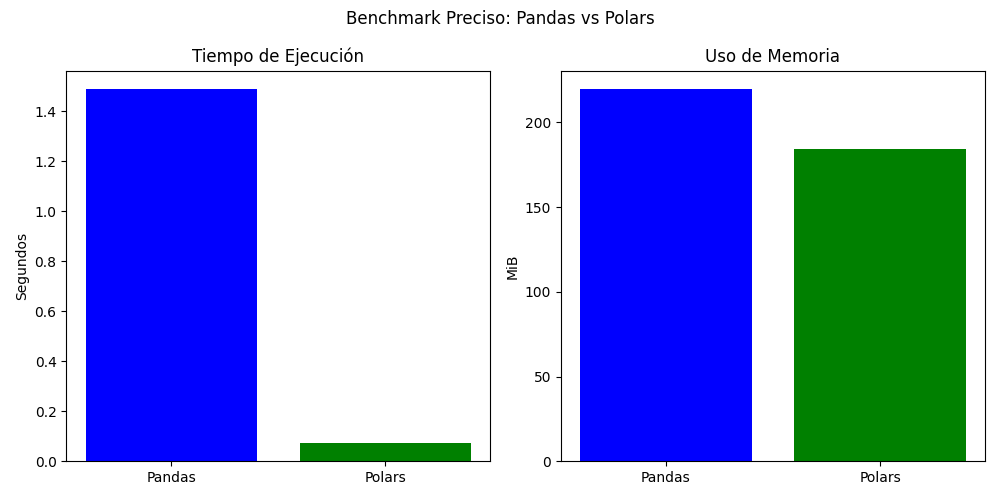

# 💻 Programación 1

**Tecnicatura Universitaria en Programación**
📍 *Universidad Tecnológica Nacional*

## ✨ Estudiantes

- **Nombres:**
- Daiana Bestabe Peña Juan
- Damián Jorge Portillo
- **Comisión:** M2025-19

## **Trabajo Práctico Integrador** - **Análisis de algoritmos**

# 📊 Comparativa de eficiencia: Pandas vs Polars en lectura de archivos CSV

Este proyecto realiza un análisis comparativo entre las bibliotecas **Pandas** y **Polars** en Python, enfocándose en la eficiencia temporal (tiempo de ejecución) y eficiencia espacial (uso de memoria) al cargar un archivo CSV grande.

---

## 🧠 Objetivo

Evaluar cuál de las dos bibliotecas —Pandas o Polars— ofrece un mejor rendimiento para tareas de análisis de datos, específicamente en la carga de archivos CSV, una operación común en ciencia de datos y análisis empresarial.

---

## 🛠️ Tecnologías Utilizadas

- Python 3.10+
- [Pandas](https://pandas.pydata.org/)
- [Polars](https://pola.rs/)
- [psutil](https://psutil.readthedocs.io/en/latest/)
- [matplotlib](https://matplotlib.org/)
- [time](https://docs.python.org/3/library/time.html)
- [os](https://docs.python.org/3/library/os.html)

---

## 📁 Estructura del Proyecto

```
📦comparativa_csv
 ┣ 📄 benchmark.py
 ┣ 📄 README.md
 ┣ 📄 train_split_00.csv
 ┗ 📊 resultados.png
```

---

## 🚀 Cómo ejecutar

1. Asegúrate de tener las bibliotecas necesarias instaladas:

```bash
pip install pandas polars psutil matplotlib
```

2. Ejecuta el archivo principal:

```bash
python benchmark.py
```

3. El script:
   - Carga el CSV con Pandas y luego con Polars.
   - Mide el tiempo y memoria utilizados.
   - Muestra las primeras filas de cada DataFrame.
   - Grafica los resultados comparativos.

---

## 📈 Resultados de ejemplo

```
[Pandas] Primeras filas:
...

[Polars] Primeras filas:
...

--- Resultados ---
Pandas - Tiempo: 1.3562 s | Memoria: 220.33 MiB
Polars - Tiempo: 0.0554 s | Memoria: 138.43 MiB
```

<p align="center">
  
</p>

---

## ✅ Conclusiones

- **Polars** es significativamente más rápido y eficiente en memoria que **Pandas** al cargar archivos CSV grandes.
- Aunque ambas bibliotecas cumplen con la tarea, **Polars** es ideal para procesamiento en entornos de alto volumen de datos.
- El análisis empírico demuestra que la elección de herramientas puede afectar seriamente el rendimiento de una aplicación.

---

## 📚 Referencias

- https://pandas.pydata.org/
- https://pola.rs/
- https://psutil.readthedocs.io/
- https://matplotlib.org/
- https://bigocheatsheet.com/
